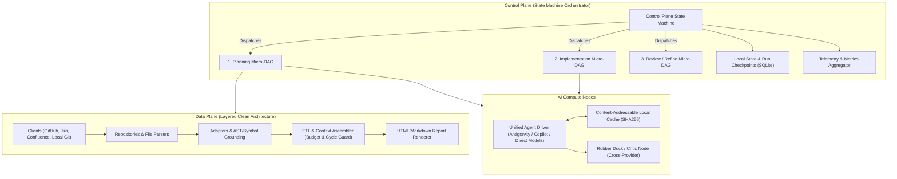
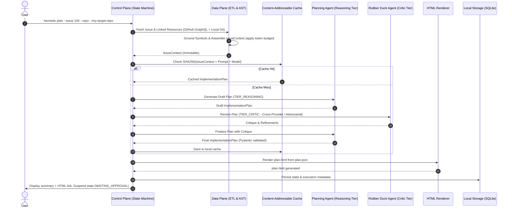
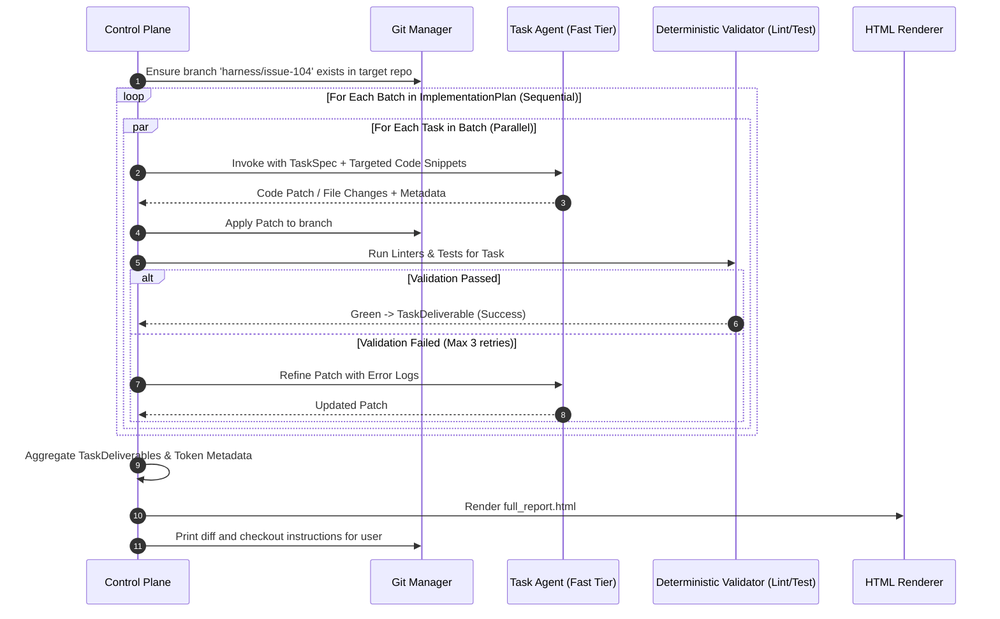

# Project Outline (Revised): Hermetic Pure-Function DAG AI Coding Harness

## 1. Executive Summary & Core Philosophy

The **Hermetic Pure-Function DAG AI Coding Harness** is a code generation and software engineering harness built on a foundational separation of concerns:
* **Deterministic tasks** (data fetching, parsing, repo indexing, AST analysis, schema validation, linting, testing, and git operations) are executed hermetically, idempotently, and predictably by traditional software engineering components.
* **Probabilistic AI models (LLMs)** are invoked exclusively for tasks requiring judgement, synthesis, planning, code generation, and critical review.

LLMs are treated as **pure-ish, bounded functions** inside execution nodes:
* **Strict Input**: An immutable, self-contained, typed schema (e.g., `IssueContext`) containing all necessary code snippets, issue details, and documentation. No ad-hoc tool wandering or retrieval inside the node.
* **Bounded Compute**: Prompt template, system instructions, temperature `0.0`, and assigned model tier.
* **Strict Output**: A strictly validated deliverable schema (e.g., `ImplementationPlan`, `TaskDeliverable`).

---

## 2. System Architecture & Extensibility

The system is organized into two primary planes and an orchestration model:



### A. Control Plane (State Machine over Micro-DAGs)
* **Architecture Pattern**: State Machine orchestrating focused, acyclic Micro-DAGs (`Intake` $\to$ `Planning` $\to$ `Critic / Rubber Duck` $\to$ `HITL Review` $\to$ `Batch Execution` $\to$ `Verification` $\to$ `Final Delivery`).
* **State & Checkpoints**: Powered by local SQLite (`.harness/state.db`). Supports full suspension and resumption (e.g., waiting for human approval or recovering from a transient failure).
* **Telemetry & Metrics**: Every node execution returns a `NodeExecutionMetadata` record (latency, tokens, cost, cache status). The Control Plane natively aggregates these into run summaries without requiring external hooks.
* **Isolation**: All code generation operations occur on dedicated Git branches (e.g., `harness/issue-<id>`).

### B. Data Plane (Deterministic & Extensible Layers)
Structured using clean architecture layers:
1. `client`: Native HTTP/GraphQL clients for issue trackers and doc systems (GitHub GraphQL/REST, Jira, Confluence).
2. `repository`: Local filesystem and local Git repository access for target repos (supports primary repo and optional secondary repos).
3. `adapter`: Normalizers that transform external payloads (GitHub issues, Jira tickets, PRs, Confluence pages, markdown docs) into unified internal representations.
4. `indexer`: Deterministic codebase grounding (symbol resolution via regex/AST/ripgrep).
5. `etl`: Aggregates, deduplicates, and validates data into self-contained context schemas.
6. `renderer`: Automatically renders human-readable HTML previews (`plan.html`, `review.html`) from JSON schemas using lightweight Jinja2 templates whenever schemas are generated or updated.

### C. Future-Extensibility ("Not Future-Excluded")
* **Jira & Confluence Integration**: The core planning engine depends only on `IssueContext` and `ExternalDoc`. Adding Jira/Confluence only requires a `JiraClient` and `ConfluenceAdapter` in the Data Plane. The planning and execution compute nodes never know or care which provider supplied the ticket.
* **Multi-Repo Updates**: The schema supports an optional `repo_name` / `repo_path` override per `TaskItem`. If a feature touches both a frontend and backend repository, different batches/tasks can target different repos while sharing the same unified plan and execution report.
* **Self-Updating (Dogfooding)**: Because the harness targets repositories via local path (`--repo .`), the harness can run on itself (`hermetic plan --issue 42 --repo .`). It creates branch `harness/issue-42`, generates a plan for its own codebase, modifies its own code in `src/hermetic/`, verifies changes against its own test suite (`pytest`), and produces an approval report.

---

## 3. Workflows & Standard Operating Procedures

### Workflow 1: Implementation Planning, Critic, & HITL



1. **Intake & Fetching**:
   - Issue and discussion retrieved via GitHub GraphQL in a single HTTP request (or Jira API).
   - High-confidence code references resolved locally against the target repo.
2. **Context Assembly**:
   - Data packed into immutable `IssueContext` with token budget caps.
3. **Planning & Rubber Ducking**:
   - `TIER_REASONING` generates initial plan.
   - `TIER_CRITIC` reviews for edge cases, missing verification steps, and oversized tasks.
   - Final `ImplementationPlan` produced and validated via Pydantic.
4. **Auto-Rendering**:
   - `plan.html` is automatically compiled from `plan.json` for rich visual review.
5. **Clarification Escalation**:
   - If information is missing, agent requests targeted fetch.
   - If still ambiguous, agent prompts user; run suspends until user answers.
6. **Review Gate**:
   - Suspends in SQLite until user approves via `hermetic approve <run-id>`.

---

### Workflow 2: Batch Execution & Verification



1. **Batch Sequencing**: Batches run sequentially; tasks in a batch execute concurrently.
2. **Dumb-Proof Execution**: Tasks executed by `TIER_FAST` (Gemini Flash / Claude Haiku).
3. **Local Validation**: Formatting, linting, and targeted tests run locally on the target repo.
4. **Self-Healing Loop**: Up to 3 retries per task with error output fed back to the model.
5. **Aggregation**: `FullImplementationReport` and `full_report.html` generated with diffs, test summaries, and token counts.

---

## 4. Contract Schemas (Pydantic Models)

All schemas are strictly typed, serializable to JSON, and explicitly reference the target repository.

### A. `IssueContext` (Preloaded & Self-Contained)
```python
class CodeSnippet(BaseModel):
    file_path: str
    start_line: int
    end_line: int
    content: str
    symbol_name: str | None = None
    repo_name: str | None = None  # Populated if multi-repo

class ExternalDoc(BaseModel):
    url_or_id: str
    title: str
    content: str
    source_type: str  # "github_wiki", "confluence", "pr", "issue", "markdown"

class IssueContext(BaseModel):
    schema_version: str = "1.0"
    repo_name: str          # e.g., "owner/my-app"
    repo_path: str          # Local filesystem path to target repo
    base_branch: str        # e.g., "main"
    issue_id: str           # GitHub issue number or Jira key (e.g. "PROJ-123")
    title: str
    body: str
    author: str
    labels: list[str]
    comments: list[str]
    code_snippets: list[CodeSnippet]
    referenced_docs: list[ExternalDoc]
    user_clarifications: dict[str, str] = Field(default_factory=dict)
```

### B. `ImplementationPlan`
```python
class TaskItem(BaseModel):
    task_id: str
    title: str
    instructions: str
    target_files: list[str]
    expected_outcome: str
    verification_command: str | None = None
    repo_name: str | None = None  # None = default to plan.repo_name

class TaskBatch(BaseModel):
    batch_index: int
    name: str
    tasks: list[TaskItem]  # Executed in parallel

class ImplementationPlan(BaseModel):
    schema_version: str = "1.0"
    repo_name: str
    repo_path: str
    base_branch: str
    working_branch: str    # e.g., "harness/issue-104"
    issue_id: str
    summary: str
    architectural_notes: str
    acceptance_criteria: list[str]
    testing_strategy: str
    batches: list[TaskBatch]  # Executed sequentially
```

### C. `TaskDeliverable` & `FullImplementationReport`
```python
class TaskDeliverable(BaseModel):
    task_id: str
    status: Literal["SUCCESS", "FAILED", "SKIPPED"]
    repo_name: str | None = None
    modified_files: list[str]
    patch_diff: str
    test_output: str | None = None
    retry_count: int = 0
    error_message: str | None = None
    input_tokens: int = 0
    output_tokens: int = 0
    latency_ms: int = 0

class FullImplementationReport(BaseModel):
    run_id: str
    repo_name: str
    repo_path: str
    issue_id: str
    branch_name: str
    overall_status: Literal["PASSED", "FAILED_VERIFICATION", "INCOMPLETE"]
    task_deliverables: list[TaskDeliverable]
    total_latency_ms: int
    token_usage_summary: dict[str, int]  # {"total_input": X, "total_output": Y, "estimated_cost_usd": Z}
```

### D. `ResearchDossier` (Spikes & Investigations)
```python
class ResearchDossier(BaseModel):
    topic: str
    repo_name: str
    objective: str
    findings: list[str]
    tradeoffs_analyzed: list[dict[str, str]]
    recommended_path: str
    open_questions: list[str]
    citations: list[str]
```

### E. `ReviewReport` (Code Review)
```python
class ReviewFinding(BaseModel):
    severity: Literal["CRITICAL", "WARNING", "SUGGESTION"]
    file_path: str
    line_number: int | None
    comment: str
    suggested_fix: str | None

class ReviewReport(BaseModel):
    pr_id: str
    repo_name: str
    summary: str
    passed: bool
    findings: list[ReviewFinding]
    test_coverage_assessment: str
```

---

## 5. Technical Decisions & Infrastructure

### A. Python Version & Environment: Python 3.12 pinned via `uv`
* **Target Version: Python 3.12**
  * *Why 3.12*: Python 3.12 is the current industry sweet spot. It provides maximum performance, full Pydantic v2 support, and 100% precompiled binary wheel availability on Windows.
  * *Addressing Python 3.14 on the host machine*: You do **not** need to uninstall or downgrade Python on your host system. `uv` isolates Python runtimes automatically.
  * Running `uv python pin 3.12` instructs `uv` to download and isolate a dedicated Python 3.12 runtime, completely bypassing host PATH versions.
* **100% `uv` Project Management**:
  * Dependencies declared in `pyproject.toml` and locked in `uv.lock`.
  * Commands run seamlessly: `uv run hermetic ...`.
  * Eliminates global package contamination and manual virtualenv activation.

### B. Telemetry & Token Tracking: Native Result Metadata
* No complex third-party hooks required.
* The `AgentDriver` extracts native token counts (`usage_metadata`) and latency from LLM responses.
* Each node yields a `NodeExecutionMetadata` object:
  ```python
  class NodeExecutionMetadata(BaseModel):
      node_id: str
      model_name: str
      latency_ms: int
      input_tokens: int
      output_tokens: int
      cached: bool
  ```
* The Control Plane sums these across all nodes into `FullImplementationReport.token_usage_summary`.

### C. Rubber Duck / Critic Architecture (`TIER_CRITIC`)
To prevent models from rubber-stamping their own mistakes:
* **Multi-Provider Critique (Preferred)**: When configured, the planning node uses Model A (e.g. Gemini Pro / Claude Sonnet), while the critic node uses Model B from a different provider family. Different architectures catch blind spots that self-critique misses.
* **Adversarial Persona Fallback**: If using a single provider, the critic node uses a strictly scoped adversarial prompt ("*Act as a skeptical Principal Engineer. Find race conditions, unhandled edge cases, missing rollback strategies, and oversized tasks.*").

### D. Persistence & Artifact Organization
Runs are organized hierarchically by **workflow** and **identifier/timestamp**:

```
.harness/
├── state.db                                     # SQLite state & checkpoints
├── cache/                                       # Content-addressable SHA256 cache
│   └── 8f4b2c...json
└── runs/
    ├── plan/
    │   └── issue-104_20260912-104522/
    │       ├── issue_context.json
    │       ├── plan.json
    │       ├── plan.html                        # Auto-rendered preview
    │       └── metadata.json
    ├── implement/
    │   └── issue-104_20260912-110500/
    │       ├── full_report.json
    │       ├── full_report.html                 # Auto-rendered preview
    │       └── patches/
    │           ├── task-1.patch
    │           └── task-2.patch
    └── research/
        └── spike-auth_20260912-120000/
            ├── dossier.json
            └── dossier.html
```

### E. Auto-Rendering HTML Previews
* A dedicated renderer module in `src/hermetic/data/renderer/` uses lightweight Jinja2 templates.
* Whenever `plan.json` or `full_report.json` is generated or updated, `render_plan_to_html()` is called deterministically to output `plan.html`.
* Provides an interactive, clean interface with collapsible task batches, file links, and verification status for human review.

---

## 6. Project Directory Layout

```
hermetic-pure-function-dag-coding-harness/
├── pyproject.toml              # Dependencies & metadata (uv managed)
├── uv.lock                     # Deterministic dependency lockfile
├── .python-version             # Pinned to 3.12 (via uv)
├── README.md                   # Quickstart and overview
├── ProjectOutline-revised.md   # This specification document
├── .harness/                   # Local runtime data (gitignored)
│   ├── state.db                # SQLite run state & checkpoints
│   ├── cache/                  # Content-addressable cache entries
│   └── runs/                   # Structured run artifacts by workflow
├── src/
│   └── hermetic/
│       ├── __init__.py
│       ├── cli/                # Command-line interface (Typer/Rich)
│       │   ├── __init__.py
│       │   └── main.py
│       ├── control/            # Control Plane
│       │   ├── __init__.py
│       │   ├── state_machine.py # Workflow state machine & HITL suspension
│       │   ├── dag_engine.py   # Topological async DAG runner
│       │   └── telemetry.py    # Native execution metadata aggregator
│       ├── data/               # Data Plane
│       │   ├── __init__.py
│       │   ├── client/         # GitHub, Jira, Confluence clients
│       │   ├── repository/     # Local git & target repo filesystem access
│       │   ├── adapter/        # External payload normalizers
│       │   ├── indexer/        # AST / symbol grounding
│       │   ├── etl/            # Context assembler & budget allocator
│       │   └── renderer/       # Jinja2 HTML/Markdown report generator
│       ├── compute/            # AI Compute & Adapters
│       │   ├── __init__.py
│       │   ├── agent_driver.py # Unified Copilot / Antigravity / API driver
│       │   ├── critic.py       # Rubber Duck / Critic evaluation node
│       │   ├── cache.py        # Content-addressable SHA256 cache
│       │   └── prompts/        # Hermetic prompt templates
│       └── schemas/            # Pydantic Contract Schemas
│           ├── __init__.py
│           ├── context.py      # IssueContext, CodeSnippet, ExternalDoc
│           ├── plan.py         # ImplementationPlan, TaskBatch, TaskItem
│           ├── deliverable.py  # TaskDeliverable, FullImplementationReport
│           └── research.py     # ResearchDossier, ReviewReport
└── tests/                      # Unit and integration tests
    ├── test_dag_engine.py
    ├── test_schemas.py
    ├── test_cache.py
    └── test_etl.py
```

---

## 7. Immediate Next Steps (Phase 1 Implementation)

1. **Initialize Project**: Run `uv init`, pin Python 3.12 (`uv python pin 3.12`), and declare dependencies (`pydantic`, `typer`, `rich`, `jinja2`, `aiosqlite`, `pytest`).
2. **Implement Core Schemas**: Write `context.py`, `plan.py`, `deliverable.py`, and `research.py` in `src/hermetic/schemas/`.
3. **Implement HTML Renderer**: Create the Jinja2 template and compiler to generate `plan.html` from `plan.json`.
4. **Implement Custom DAG Engine & Local Cache**: Write the topological DAG runner and SHA256 cache.
5. **Implement End-to-End Walking Skeleton**: Issue $\to$ `IssueContext` $\to$ Planning Node $\to$ `plan.json` $\to$ `plan.html`.
