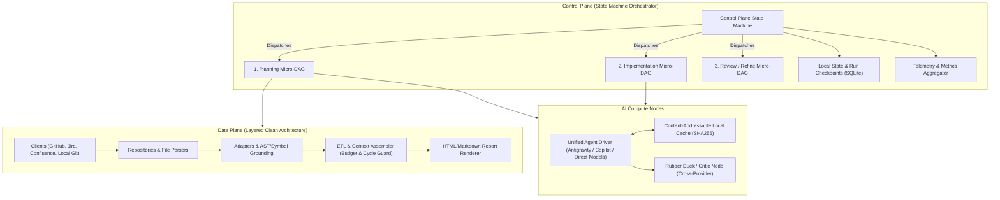
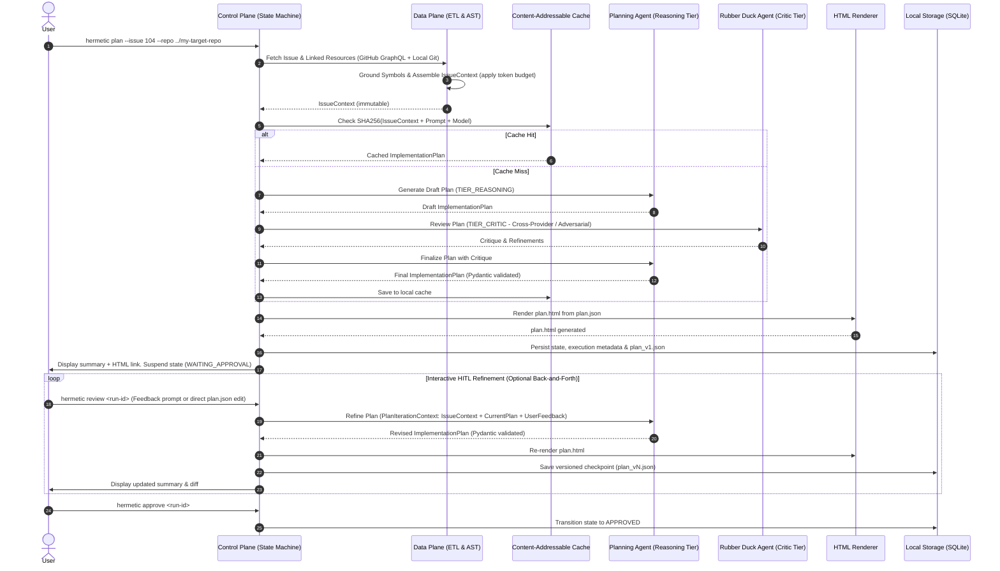
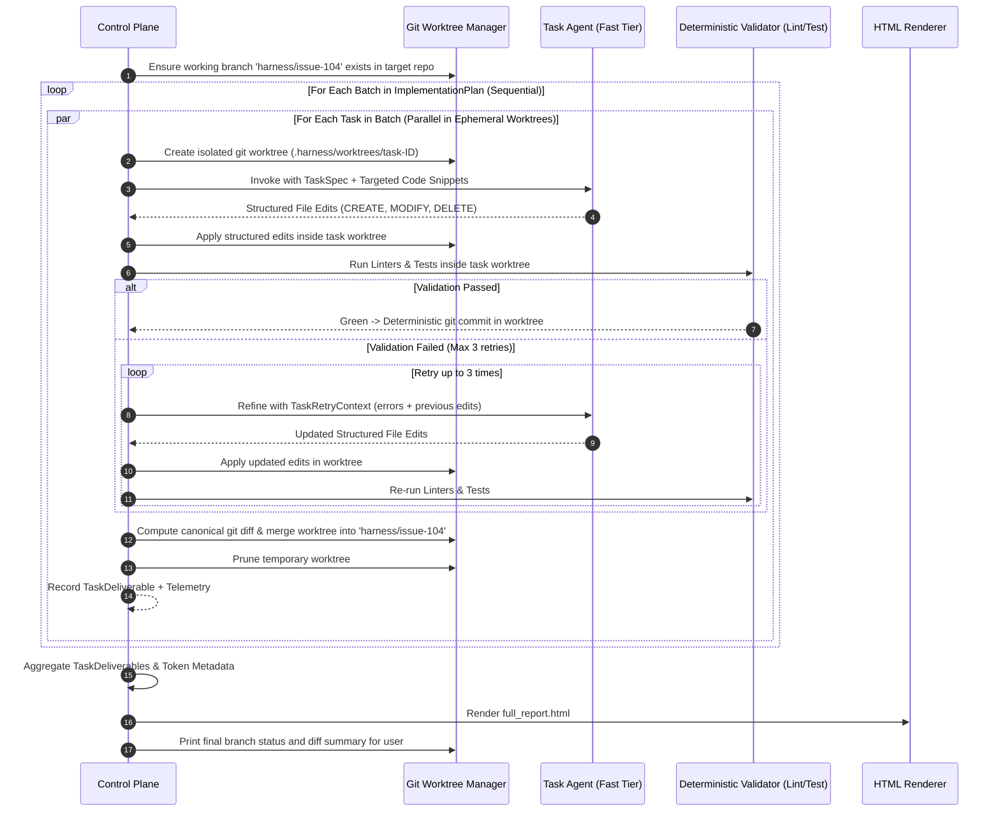

# Project Outline (Revised): Hermetic Pure-Function DAG AI Coding Harness

## 1. Executive Summary & Core Philosophy

The **Hermetic Pure-Function DAG AI Coding Harness** is a code generation and software engineering harness built on a foundational separation of concerns:
* **Deterministic tasks** (data fetching, parsing, repo indexing, AST analysis, schema validation, linting, testing, and git operations) are executed hermetically, idempotently, and predictably by traditional software engineering components.
* **Probabilistic AI models (LLMs)** are invoked exclusively for tasks requiring judgement, synthesis, planning, code generation, and critical review.

LLMs are treated as **pure-ish, bounded functions** inside execution nodes:
* **Strict Input**: An immutable, self-contained, typed schema (e.g., `IssueContext`) containing all necessary code snippets, issue details, and documentation. No ad-hoc tool wandering or retrieval inside the node.
* **Bounded Compute**: Prompt template, system instructions, temperature `0.0`, and assigned model tier.
* **Strict Output**: A strictly validated deliverable schema (e.g., `ImplementationPlan`, `TaskDeliverable`).

---

## 2. System Architecture & Extensibility

The system is organized into two primary planes and an orchestration model:



### A. Control Plane (State Machine over Micro-DAGs)
* **Architecture Pattern**: State Machine orchestrating focused, acyclic Micro-DAGs (`Intake` $\to$ `Planning` $\to$ `Critic / Rubber Duck` $\to$ `Interactive HITL Review` $\to$ `Batch Execution` $\to$ `Verification` $\to$ `Final Delivery`).
* **State & Checkpoints**: Powered by local SQLite (`.harness/state.db`). Supports full suspension and resumption (e.g., waiting for human review or recovering from a transient failure).
* **Interactive HITL Refinement**: The user can converse, critique, or directly edit the plan. Every feedback turn triggers a functional state transition yielding a versioned checkpoint (`plan_v1.json`, `plan_v2.json`) with instant rollback capabilities.
* **Telemetry & Metrics**: Every node execution returns a `NodeExecutionMetadata` record (latency, tokens, cost, cache status). The Control Plane natively aggregates these into run summaries without requiring external hooks.
* **Hermetic Isolation**: All code generation occurs on dedicated Git branches (e.g., `harness/issue-<id>`). Parallel tasks within a batch are sandboxed in ephemeral `git worktree` instances. AI nodes have read-only access and emit structured edits; only the deterministic harness can commit and merge.

### B. Data Plane (Deterministic & Extensible Layers)
Structured using clean architecture layers:
1. `client`: Native HTTP/GraphQL clients for issue trackers and doc systems (GitHub GraphQL/REST, Jira, Confluence).
2. `repository`: Local filesystem and local Git repository access for target repos, including ephemeral worktree management (`worktree.py`).
3. `adapter`: Normalizers that transform external payloads (GitHub issues, Jira tickets, PRs, Confluence pages, markdown docs) into unified internal representations.
4. `indexer`: Deterministic codebase grounding (symbol resolution via regex/AST/ripgrep).
5. `etl`: Aggregates, deduplicates, and validates data into self-contained context schemas with strict token budget enforcement.
6. `renderer`: Automatically renders human-readable HTML previews (`plan.html`, `review.html`) from JSON schemas using lightweight Jinja2 templates whenever schemas are generated or updated.

### C. Pure Compute Plane & Unified Agent Driver
* **Stateless Compute Behind Interactive UX**: Regardless of whether the backend is Direct Model APIs (Gemini, Claude, GPT), Antigravity, or Copilot, all AI node executions are **stateless, non-interactive invocations with evolving supporting context**.
* **Driver Modalities**:
  1. `DirectDriver` (LiteLLM / Native SDKs): Direct HTTP API requests with schema-constrained JSON mode.
  2. `AntigravityDriver` (Headless CLI / Subprocess): Runs Antigravity headlessly with an immutable task schema and extracts structured JSON outputs.
  3. `CopilotDriver` (CLI / API): Headless Copilot invocation with bounded input prompts.
* **Why This Matters**: The user gets the rich, fluid experience of an interactive session, while the compute engine preserves 100% pure-function determinism, token accounting, and content-addressable caching.

### D. Future-Extensibility ("Not Future-Excluded")
* **Jira & Confluence Integration**: The core planning engine depends only on `IssueContext` and `ExternalDoc`. Adding Jira/Confluence only requires a `JiraClient` and `ConfluenceAdapter` in the Data Plane. The planning and execution compute nodes never know or care which provider supplied the ticket.
* **Multi-Repo Updates**: The schema supports an optional `repo_name` / `repo_path` override per `TaskItem`. If a feature touches both a frontend and backend repository, different batches/tasks can target different repos while sharing the same unified plan and execution report.
* **Self-Updating (Dogfooding)**: Because the harness targets repositories via local path (`--repo .`), the harness can run on itself (`hermetic plan --issue 42 --repo .`). It creates branch `harness/issue-42`, generates a plan for its own codebase, modifies its own code in `src/hermetic/`, verifies changes against its own test suite (`pytest`), and produces an approval report.

---

## 3. Workflows & Standard Operating Procedures

### Workflow 1: Implementation Planning, Critic, & Interactive HITL



1. **Intake & Fetching**:
   - Issue and discussion retrieved via GitHub GraphQL in a single HTTP request (or Jira API).
   - High-confidence code references resolved locally against the target repo.
2. **Context Assembly**:
   - Data packed into immutable `IssueContext` with token budget caps.
3. **Planning & Rubber Ducking**:
   - `TIER_REASONING` generates initial plan with tasks partitioned into file-disjoint batches.
   - `TIER_CRITIC` reviews for edge cases, missing verification steps, race conditions, and oversized tasks.
   - Final `ImplementationPlan` produced and sanitized/validated via Pydantic.
4. **Auto-Rendering**:
   - `plan.html` is automatically compiled from `plan.json` for rich visual review.
5. **Interactive HITL Refinement (Pure State Transitions, Not Chat Logs)**:
   - The user inspects `plan.html` or the CLI summary.
   - The user can converse/critique via interactive CLI (`hermetic review <run-id>` or `hermetic plan --resume <run-id> --feedback "..."`), or edit `plan.json` directly.
   - **No Conversational Transcript Accumulation**: The harness does **not** compile growing multi-turn chat logs into the prompt. Instead, each turn is a pure state transformation:
     $$\text{Plan}_{n+1} = \text{PlanningNode}(\text{IssueContext}, \text{Plan}_n, \text{UserFeedback}_n)$$
     The LLM sees only the immutable `IssueContext`, the current structured `plan.json`, and the user's latest feedback directive.
   - **Semantic Diff for the Human**: The CLI presents the human with a concise semantic diff of what was changed (added/modified/removed tasks or batches) between versions, and deterministically regenerates `plan.html`.
   - Each refinement turn saves a versioned checkpoint (`plan_v1.json`, `plan_v2.json`, etc.) with instant rollback support.
6. **Review Gate**:
   - Suspends in SQLite until user approves via `hermetic approve <run-id>`, which re-validates the schema before unblocking execution.

---

### Workflow 2: Batch Execution & Ephemeral Worktree Verification



1. **Batch Sequencing & File Disjointness**:
   - Batches execute sequentially. Tasks within a batch are planned to touch disjoint file sets and execute concurrently.
2. **Ephemeral Git Worktree Sandboxing**:
   - For each concurrent task, the harness creates an isolated git worktree (`.harness/worktrees/task-<id>`). Tests and file modifications run strictly in isolation without workspace collisions.
3. **Structured File Edits (Deterministic)**:
   - LLMs emit structured file edits (`StructuredFileEdit`: path, action, content/search-and-replace blocks). The LLM has zero shell or git access.
4. **Deterministic Validation & Git Operations**:
   - The harness applies edits, runs linters (e.g. `ruff format`), and executes verification commands inside the worktree.
   - On green, the harness commits, computes the canonical `git diff`, merges the task branch into `harness/issue-<id>`, and removes the worktree.
5. **Pure-Function Self-Healing Loop**:
   - When validation fails, a `TaskRetryContext` (attempt number, compiler/test output, failed edits) is passed as an immutable input to the model.
   - Every retry records a distinct `NodeExecutionMetadata` entry in SQLite for full retry tracking and cost auditability.
6. **Batch Failure Semantics (Hard Stop)**:
   - If one or more tasks in a batch exhaust all retries and remain in `FAILED` status, **the entire run halts immediately**. Subsequent batches are not executed because they depend on the outputs of prior batches.
   - All successfully completed task worktrees from the failed batch that were already merged into `harness/issue-<id>` remain on the branch. The run state is persisted in SQLite as `FAILED_BATCH_N`.
   - The `FullImplementationReport` is generated with partial results, marking failed tasks and all skipped downstream batches explicitly.
   - **Resumption** from a failed batch (after the user resolves the root cause, e.g., by editing the plan or fixing an external dependency) is a roadmap item. See Roadmap §4. In Phase 1, the user must start a new run or manually amend the branch.
7. **Aggregation**: `FullImplementationReport` and `full_report.html` generated with diffs, test summaries, and token counts.

---

## 4. Contract Schemas (Pydantic Models)

All schemas are strictly typed, serializable to JSON, and explicitly reference the target repository.

### A. `IssueContext` (Preloaded & Self-Contained)
```python
class CodeSnippet(BaseModel):
    file_path: str
    start_line: int
    end_line: int
    content: str
    symbol_name: str | None = None
    repo_name: str | None = None  # Populated if multi-repo

class ExternalDoc(BaseModel):
    url_or_id: str
    title: str
    content: str
    source_type: str  # "github_wiki", "confluence", "pr", "issue", "markdown"

class IssueContext(BaseModel):
    schema_version: Literal["1.0"] = "1.0"
    repo_name: str          # e.g., "owner/my-app"
    repo_path: str          # Local filesystem path to target repo
    base_branch: str        # e.g., "main"
    issue_id: str           # GitHub issue number or Jira key (e.g. "PROJ-123")
    title: str
    body: str
    author: str
    labels: list[str]
    comments: list[str]
    code_snippets: list[CodeSnippet]
    referenced_docs: list[ExternalDoc]
    user_clarifications: dict[str, str] = Field(default_factory=dict)
```

### B. `ImplementationPlan` & Interactive Refinement
```python
class TaskItem(BaseModel):
    task_id: str
    title: str
    instructions: str
    target_files: list[str]  # Must be strictly disjoint across tasks in the same batch
    expected_outcome: str
    verification_command: str | None = None
    repo_name: str | None = None  # None = default to plan.repo_name

class TaskBatch(BaseModel):
    batch_index: int
    name: str
    tasks: list[TaskItem]  # Executed in parallel across ephemeral git worktrees

class ImplementationPlan(BaseModel):
    schema_version: Literal["1.0"] = "1.0"
    repo_name: str
    repo_path: str
    base_branch: str
    working_branch: str    # Auto-derived by harness as f"harness/issue-{issue_id}"; not LLM-emitted
    issue_id: str
    summary: str
    architectural_notes: str
    acceptance_criteria: list[str]
    testing_strategy: str
    batches: list[TaskBatch]  # Executed sequentially

class UserFeedback(BaseModel):
    iteration: int
    timestamp: str
    feedback_text: str

class PlanIterationContext(BaseModel):
    issue_context: IssueContext
    current_plan: ImplementationPlan
    critic_critique: str | None = None
    feedback_history: list[UserFeedback] = Field(default_factory=list)  # Harness-controlled; bounded N entries; never a raw chat log
```

### C. `TaskDeliverable`, `StructuredFileEdit`, & `TaskRetryContext`
```python
class SearchReplaceBlock(BaseModel):
    search_target: str
    replacement: str

class StructuredFileEdit(BaseModel):
    file_path: str
    action: Literal["CREATE", "MODIFY", "DELETE"]
    new_content: str | None = None       # Full content for newly created files
    blocks: list[SearchReplaceBlock] = Field(default_factory=list) # Chunks for modifications

class TaskRetryContext(BaseModel):
    task_spec: TaskItem
    attempt_number: int                  # 1..3
    failed_edits: list[StructuredFileEdit]
    validation_error_output: str         # Captured linter / test stdout and stderr
    previous_patch_diff: str | None = None

class TaskDeliverable(BaseModel):
    task_id: str
    status: Literal["SUCCESS", "FAILED", "SKIPPED"]
    repo_name: str | None = None
    structured_edits: list[StructuredFileEdit] = Field(default_factory=list)
    patch_diff: str = ""                 # Canonical diff generated deterministically by Git
    test_output: str | None = None
    retry_count: int = 0
    error_message: str | None = None
    input_tokens: int = 0
    output_tokens: int = 0
    latency_ms: int = 0

class FullImplementationReport(BaseModel):
    run_id: str
    repo_name: str
    repo_path: str
    issue_id: str
    branch_name: str
    overall_status: Literal["PASSED", "FAILED_VERIFICATION", "INCOMPLETE"]
    task_deliverables: list[TaskDeliverable]
    total_latency_ms: int
    token_usage_summary: dict[str, int]  # {"total_input": X, "total_output": Y, "estimated_cost_usd": Z}
```

### D. `ResearchDossier` (Spikes & Investigations)
*Defined in `src/hermetic/schemas/research.py`.*
```python
class ResearchDossier(BaseModel):
    topic: str
    repo_name: str
    objective: str
    findings: list[str]
    tradeoffs_analyzed: list[dict[str, str]]
    recommended_path: str
    open_questions: list[str]
    citations: list[str]
```

### E. `ReviewReport` (Code Review)
*Defined in `src/hermetic/schemas/review.py` (separate from `research.py` — these are distinct workflows).*
```python
class ReviewFinding(BaseModel):
    severity: Literal["CRITICAL", "WARNING", "SUGGESTION"]
    file_path: str
    line_number: int | None
    comment: str
    suggested_fix: str | None

class ReviewReport(BaseModel):
    pr_id: str
    repo_name: str
    summary: str
    passed: bool
    findings: list[ReviewFinding]
    test_coverage_assessment: str
```

---

## 5. Technical Decisions & Infrastructure

### A. Python Version & Environment: Python 3.12 pinned via `uv`
* **Target Version: Python 3.12**
  * *Why 3.12*: Python 3.12 is the current industry sweet spot. It provides maximum performance, full Pydantic v2 support, and 100% precompiled binary wheel availability on Windows.
  * *Addressing Python 3.14 on the host machine*: You do **not** need to uninstall or downgrade Python on your host system. `uv` isolates Python runtimes automatically.
  * Running `uv python pin 3.12` instructs `uv` to download and isolate a dedicated Python 3.12 runtime, completely bypassing host PATH versions.
* **100% `uv` Project Management**:
  * Dependencies declared in `pyproject.toml` and locked in `uv.lock`.
  * Commands run seamlessly: `uv run hermetic ...`.
  * Eliminates global package contamination and manual virtualenv activation.

### B. Telemetry & Token Tracking: Native Result Metadata
* No complex third-party hooks required.
* The `AgentDriver` extracts native token counts (`usage_metadata`) and latency from LLM responses.
* Each node yields a `NodeExecutionMetadata` object:
  ```python
  class NodeExecutionMetadata(BaseModel):
      node_id: str
      model_name: str
      latency_ms: int
      input_tokens: int
      output_tokens: int
      cached: bool
      # cost_usd: deferred to roadmap — initial drivers use subscription plans (no per-token cost)
  ```
* The Control Plane sums these across all nodes into `FullImplementationReport.token_usage_summary`.

### C. Rubber Duck / Critic Architecture (`TIER_CRITIC`)
To prevent models from rubber-stamping their own mistakes:
* **Multi-Provider Critique (Preferred)**: When configured, the planning node uses Model A (e.g. Gemini Pro / Claude Sonnet), while the critic node uses Model B from a different provider family. Different architectures catch blind spots that self-critique misses. In the default driver configuration, Planning/Research/Review use Claude Sonnet (via Antigravity) and Implementation uses Gemini Flash (via Antigravity); the critic node therefore naturally uses a different model family from the planning node, satisfying the cross-provider requirement without additional configuration.
* **Adversarial Persona Fallback**: If using a single provider, the critic node uses a strictly scoped adversarial prompt ("*Act as a skeptical Principal Engineer. Find race conditions, unhandled edge cases, missing rollback strategies, and oversized tasks.*").

### D. Ephemeral Git Worktree Isolation & Deterministic Merges
To eliminate concurrency hazards during parallel task execution:
* **No Direct Working Tree Mutation**: Parallel tasks never touch the primary working branch directly.
* **Ephemeral Worktrees**: For each task $T_i$ in a batch, the Data Plane Git Manager creates a temporary worktree:
  ```bash
  git worktree add -b harness/task-Ti .harness/worktrees/task-Ti <batch_base_commit>
  ```
* **Read-Only Model Boundary**: The LLM runs with read-only view of the code. It produces structured file edits (`StructuredFileEdit`).
* **Deterministic Execution & Commits (Rebase Strategy)**:
  1. The deterministic harness writes file modifications inside `.harness/worktrees/task-Ti`.
  2. Formatters (e.g. `ruff format`) and local verification commands run strictly inside that worktree.
  3. If verification passes, the harness creates a standard commit on `harness/task-Ti`.
  4. To merge back into the batch branch (`harness/issue-<id>`) without criss-cross merge commits:
     - The harness checks out `harness/task-Ti` and rebases it onto `harness/issue-<id>`.
     - Because tasks within a batch are planned to touch strictly disjoint files, the rebase applies cleanly.
     - The harness then checks out `harness/issue-<id>` and performs a fast-forward merge of the task branch.
  5. The temporary worktree is pruned (`git worktree remove --force`).
* **Conflict Prevention & Shared Files**: Batches enforce file-disjointness at plan time. To handle central files (e.g., `pyproject.toml`, `uv.lock`, `__init__.py`), the Planning prompt strictly instructs the LLM that any task modifying these shared files MUST be isolated into its own exclusive batch to run sequentially. If an unexpected merge collision still occurs, it is detected deterministically by Git rather than hallucinated by an agent.

### E. Structured File Edits vs. Raw Git Diffs: The Deterministic Boundary
A critical architectural boundary must be maintained between probabilistic model synthesis and deterministic software engineering:
* **The Probabilistic Boundary (Model Synthesis)**:
  - The creative decision of *what* code to add, modify, or delete is inherently probabilistic; a deterministic script cannot predict code changes before an LLM synthesizes them.
  - The LLM expresses this intent strictly through the `StructuredFileEdit` schema:
    - `action="CREATE"` or `"OVERWRITE"` with `new_content`.
    - `action="MODIFY"` with targeted `SearchReplaceBlock(search_target=..., replacement=...)`.
  - Asking LLMs to emit raw unified diff syntax (`diff --git a/... b/...`) fails frequently because LLMs are poor at line-offset arithmetic and hunk headers.
* **The Deterministic Boundary (Harness Execution)**:
  - Once the model returns `StructuredFileEdit`, the LLM has zero further control over the filesystem or version control.
  - The Data Plane executes 100% deterministic code:
    1. **Target Verification**: Validates that `search_target` exists uniquely in the file using strict exact-string matching. For the MVP, we intentionally avoid complex fuzzy matching or AST substitution. This is a deliberate tradeoff: the codebase being targeted is young and small (initially the harness itself), files are short, snippets are precise, and retries are cheap. Two lightweight mitigations are applied before reaching the retry loop: (1) **Unique-match enforcement at prompt time**: the context assembler checks that every candidate search_target appears exactly once in its source file; snippets with zero or multiple matches are either excluded from the context or flagged in the prompt with a warning. (2) **Occurrence-count validation in the applier**: before applying a SearchReplaceBlock, the harness verifies that the search_target string matches exactly once in the live file content and raises a structured error (fed into TaskRetryContext) if not. These two measures eliminate the most common ambiguity failure modes. More advanced fuzzy/AST replacement strategies are deferred to the roadmap.
    2. **Directory & File Creation**: For `CREATE` actions, uses Python's native `pathlib.Path.mkdir(parents=True, exist_ok=True)` to safely and cross-platform create parent directories before writing the file.
    3. **String Substitution**: Applies the exact string replacement cleanly in the ephemeral worktree.
    4. **Deterministic Formatting**: Runs code formatters (e.g., `ruff format`, `black`, `prettier`) so formatting is uniform and predictable.
    5. **Canonical Diff Generation**: Runs `git diff` via subprocess on the actual filesystem. Git itself calculates the canonical, syntactically pristine unified diff stored in `TaskDeliverable.patch_diff`.
    6. **Deterministic Verification**: Executes linters and tests inside the worktree.
    7. **Deterministic Commits & Merges**: Creates git commits and merges branches without any LLM intervention.

### F. Output Defense: Strict Structured Outputs & Deterministic JSON Sanitizer
Even with API-level JSON mode (`response_format={"type": "json_object"}` or schema-constrained decoding), models occasionally include markdown wrappers, trailing commas, or control characters.
A two-tier defense guarantees deterministic parsing:
1. **Deterministic Sanitizer (`sanitizer.py`)**:
   - Strips markdown code fences (````json ... ````).
   - Trims conversational preambles/postscripts.
   - Normalizes trailing commas (`[1, 2,]` $\to$ `[1, 2]`) using fast regex passes before `json.loads`.
2. **Pydantic Validation**:
   - Parses into validated Pydantic model (`Model.model_validate_json(clean_str)`).
   - If validation fails, the Pydantic error details are structured into a zero-shot repair prompt or default fallback.

### G. Interactive HITL & Versioned Plan Refinement: Functional Transitions, Not Chat Transcripts
* **Non-Interactive by Default — Structured Context When Needed**:
  - **Implementation is fully hermetic and non-interactive.** Once a plan is approved, the execution DAG runs without any human interaction.
  - **Research and Planning may optionally use bounded structured context history.** Rather than accumulating a free-form chat transcript, the `feedback_history: list[UserFeedback]` field in `PlanIterationContext` carries a structured, bounded list of past `UserFeedback` objects. This is passed to the LLM as organized structured data, not a raw message list, so the model can reason about how the plan has evolved without being polluted by conversational noise.
  - **What the LLM sees is always bounded and structured**: `IssueContext` (immutable problem definition) + `current_plan` (current state) + optionally `feedback_history` (bounded prior feedback objects, harness-controlled) + `UserFeedback` (latest directive).
  - **`feedback_history` is harness-controlled, not LLM-generated.** The harness decides what to include (e.g., only the last N feedback entries). It is never a raw chat log.
  - **LLM-initiated context requests (Research DAG — Roadmap):** Instead of opening a free-form dialogue, the Research Node may emit a structured `ContextRequest` asking the Data Plane for specific symbols, files, or searches. This keeps the system hermetic while allowing the LLM to signal what information it needs.
  - **Review** may or may not benefit from feedback history; this is left as an open design question for a later phase.
* **Functional Transition Model**:
  Every interactive turn is treated as a pure state transition:
  $$\text{Plan}_{n+1} = \text{PlanningNode}(\text{IssueContext}, \text{Plan}_n, \text{UserFeedback}_n)$$
  - **What the LLM sees as context** (always bounded and structured):
    1. `IssueContext` (the immutable problem definition and repository symbols).
    2. `current_plan` (the last validated `ImplementationPlan` JSON—the current state of the architecture).
    3. `feedback_history` (optional, bounded list of prior structured `UserFeedback` objects — harness-controlled, never a raw chat log).
    4. `UserFeedback` (the user's latest critique or directive).
  - **What the Human sees**:
    - A clear, concise **semantic diff** computed between $\text{Plan}_n$ and $\text{Plan}_{n+1}$ (e.g., `+ Added Task 2.3`, `~ Modified Batch 1 scope`, `- Removed Task 3.1`).
    - The automatically refreshed `plan.html` preview in the browser.
* **CLI Interactivity**:
  - Interactive REPL: `hermetic review <run-id>` allows natural conversation, critique, and guidance in the terminal.
  - Scriptable / Single-command feedback: `hermetic plan --resume <run-id> --feedback "Split Task 2 into two steps and use SQLite WAL mode"`.
  - Direct Edit: The user can open `.harness/runs/plan/<run-id>/plan.json` in their editor, make manual edits, and resume. The harness validates the JSON against Pydantic and refreshes `plan.html` with zero LLM tokens spent.
* **Reproducibility & Rollback**:
  - Each feedback round generates a versioned artifact (`plan_v1.json`, `plan_v2.json`, `plan.html`).
  - Checkpoints are persisted in SQLite, allowing instant rollback (`--revert-to 1`) if an agent wanders off course.
* **Driver Agility (Copilot, Antigravity, Direct APIs)**:
  Because each turn is a stateless transition rather than an ongoing chat session, any provider can power the refinement turn:
  - **Antigravity**: Headless single-turn task execution with bounded context.
  - **Copilot**: Headless CLI / Language Server call.
  - **Direct APIs**: Stateless LiteLLM / Gemini / Claude API calls with schema enforcement.
  The harness owns the state, versioning, and rollback logic, keeping the AI driver strictly pure and stateless.

### H. Minimal DAG Engine (`graphlib.TopologicalSorter` + `asyncio.TaskGroup`)
* **Zero Framework Bloat**: No heavy external dependencies (no Airflow, Celery, or LangGraph).
* **Implementation Strategy**:
  - Uses Python's built-in `graphlib.TopologicalSorter` for dependency resolution.
  - Uses `asyncio.TaskGroup` for concurrent execution of independent tasks.
  - Total implementation: under 150 lines of clean, strictly typed Python in `src/hermetic/control/dag_engine.py`.
  - State transitions and checkpoint records are logged to SQLite before and after each node execution.

### I. Persistence & Artifact Organization
Runs are organized hierarchically by **workflow** and **identifier/timestamp**:

```
.harness/
├── state.db                                     # SQLite state & checkpoints
├── cache/                                       # Content-addressable SHA256 cache
│   └── 8f4b2c...json
├── worktrees/                                   # Ephemeral git worktrees (pruned after run)
│   ├── task-1/
│   └── task-2/
└── runs/
    ├── plan/
    │   └── issue-104_20260912-104522/
    │       ├── issue_context.json
    │       ├── plan_v1.json
    │       ├── plan_v2.json                     # Interactive refinement versions
    │       ├── plan.json                        # Active approved plan
    │       ├── plan.html                        # Auto-rendered preview
    │       └── metadata.json
    ├── implement/
    │   └── issue-104_20260912-110500/
    │       ├── full_report.json
    │       ├── full_report.html                 # Auto-rendered preview
    │       └── patches/
    │           ├── task-1.patch
    │           └── task-2.patch
    └── research/
        └── spike-auth_20260912-120000/
            ├── dossier.json
            └── dossier.html
```

### J. Auto-Rendering HTML Previews
* A dedicated renderer module in `src/hermetic/data/renderer/` uses lightweight Jinja2 templates.
* Whenever `plan.json` or `full_report.json` is generated or updated, `render_plan_to_html()` is called deterministically to output `plan.html`.
* Provides an interactive, clean interface with collapsible task batches, file links, and verification status for human review.

---

### K. Token Budget Strategy
* **Context Window Availability**: The default driver configuration targets Claude Sonnet (200K token context window) for Research, Planning, and Review, and Gemini Flash (1M token context window) for Implementation. For the initial phase — where the harness operates on its own small, young codebase — context overflow is not expected to be a practical concern.
* **Soft Budget Thresholds (Warn-Only in Phase 1)**:
  - Sonnet (Research/Planning/Review): warn at **150,000 tokens** assembled in `IssueContext`.
  - Flash (Implementation): warn at **750,000 tokens** assembled per `TaskSpec`.
  - No hard truncation is applied in Phase 1. If a soft threshold is exceeded, the ETL assembler logs a warning and proceeds.
* **Priority Order for Future Truncation** (defined now, enforced in a later phase when targeting larger codebases):
  1. `user_clarifications` (lowest priority — rarely critical for large tasks)
  2. Issue `comments` (truncate to most recent N)
  3. `referenced_docs` / `ExternalDoc` content (truncate body, keep title + URL)
  4. `code_snippets` (truncate least-relevant snippets last; never truncate the primary file under edit)
* **Tokenizer**: A conservative character-count approximation (÷ 3.5 chars/token) is used in Phase 1 to avoid adding a `tiktoken` dependency. A model-specific tokenizer may be introduced in a later phase for precision.
* **Cost Tracking Note**: Because the initial implementation uses subscription-based plans (Antigravity Pro), there is no per-token dollar cost. `NodeExecutionMetadata` tracks token counts for rate-limit awareness and future cost modeling. Dollar-cost estimation is deferred to the roadmap (see Roadmap §3).

### L. Agent Driver: Abstract Interface & Default Configuration
* **Abstract Base Interface**: All drivers implement a custom `AgentDriver` abstract base class (Python `abc.ABC`) defined in `src/hermetic/compute/agent_driver.py`. The interface is purpose-built for this harness and may evolve. Key abstract methods:
  ```python
  class AgentDriver(ABC):
      @abstractmethod
      async def invoke(self, prompt: str, system: str, schema: type[BaseModel]) -> BaseModel:
          """Single stateless invocation returning a validated Pydantic schema."""
          ...

      @abstractmethod
      def get_execution_metadata(self) -> NodeExecutionMetadata:
          """Returns token counts and latency for the last invocation."""
          ...
  ```
* **Driver Selection**: Configured via `pyproject.toml` or CLI flag `--driver`. Default for the POC is `AntigravityDriver` throughout.
* **Default Model Assignments**:
  | Workflow Stage | Driver | Model |
  |---|---|---|
  | Research | AntigravityDriver | Claude Sonnet (latest) |
  | Planning | AntigravityDriver | Claude Sonnet (latest) |
  | Critic / Review | AntigravityDriver | Claude Sonnet (latest) |
  | Implementation (Tasks) | AntigravityDriver | Gemini Flash (latest) |
* **MVP vs. Full Implementation**: `AntigravityDriver` is the only driver implemented in the POC. `DirectDriver` (LiteLLM) is the next planned driver (Phase 2), enabling direct API access for cost tracking and non-Antigravity deployments. `CopilotDriver` is a future consideration.

---


## 6. Project Directory Layout

```
hermetic-pure-function-dag-coding-harness/
├── pyproject.toml              # Dependencies & metadata (uv managed)
├── uv.lock                     # Deterministic dependency lockfile
├── .python-version             # Pinned to 3.12 (via uv)
├── README.md                   # Quickstart and overview
├── ProjectOutline.md           # This specification document
├── .gitignore                  # Excludes .harness/ (state, cache, worktrees, runs) and .python-version
├── .harness/                   # Local runtime data (gitignored)
│   ├── state.db                # SQLite run state & checkpoints
│   ├── cache/                  # Content-addressable cache entries
│   ├── worktrees/              # Ephemeral git worktrees
│   └── runs/                   # Structured run artifacts by workflow
├── src/
│   └── hermetic/
│       ├── __init__.py
│       ├── cli/                # Command-line interface (Typer/Rich)
│       │   ├── __init__.py
│       │   ├── main.py
│       │   └── review.py       # Interactive HITL plan review REPL
│       ├── control/            # Control Plane
│       │   ├── __init__.py
│       │   ├── state_machine.py # Workflow state machine & HITL suspension
│       │   ├── dag_engine.py   # Minimal graphlib.TopologicalSorter async runner
│       │   └── telemetry.py    # Native execution metadata aggregator
│       ├── data/               # Data Plane
│       │   ├── __init__.py
│       │   ├── client/         # GitHub, Jira, Confluence clients
│       │   ├── repository/     # Local git, target repo access & worktree manager
│       │   │   ├── __init__.py
│       │   │   ├── git_manager.py
│       │   │   └── worktree.py # Ephemeral git worktree sandboxing
│       │   ├── adapter/        # External payload normalizers
│       │   ├── indexer/        # AST / symbol grounding
│       │   ├── etl/            # Context assembler & budget allocator
│       │   └── renderer/       # Jinja2 HTML/Markdown report generator
│       ├── compute/            # AI Compute & Adapters
│       │   ├── __init__.py
│       │   ├── agent_driver.py # Unified Copilot / Antigravity / API driver
│       │   ├── sanitizer.py    # Resilient JSON cleaning & validation defense
│       │   ├── critic.py       # Rubber Duck / Critic evaluation node
│       │   ├── cache.py        # Content-addressable SHA256 cache
│       │   └── prompts/        # Hermetic prompt templates
│       └── schemas/            # Pydantic Contract Schemas
│           ├── __init__.py
│           ├── context.py      # IssueContext, CodeSnippet, ExternalDoc
│           ├── plan.py         # ImplementationPlan, TaskBatch, TaskItem, PlanIterationContext
│           ├── deliverable.py  # TaskDeliverable, StructuredFileEdit, TaskRetryContext
│           ├── research.py     # ResearchDossier
│           └── review.py       # ReviewReport, ReviewFinding
└── tests/                      # Unit and integration tests
    ├── test_dag_engine.py
    ├── test_schemas.py
    ├── test_sanitizer.py
    ├── test_worktree.py
    ├── test_cache.py
    ├── test_etl.py
    └── test_agent_driver.py
```

---

## 7. Implementation Phases

### Phase 0 — Project Scaffold & Tooling (Zero LLM calls)
1. **Initialize Project**: `uv python pin 3.12`, declare dependencies (`pydantic>=2.0`, `typer`, `rich`, `jinja2`, `aiosqlite`, `pytest`), create `pyproject.toml` with a `hermetic` CLI entry point.
2. **Directory Layout**: Create all `src/hermetic/` package stubs and `tests/` files.
3. **`.gitignore`**: Add `.harness/` (state, cache, worktrees, runs) and `.python-version` to `.gitignore`.

### Phase 1a — Core Schemas, Sanitizer & DAG Engine (Pure Python, No I/O)
4. **Implement Core Schemas**: Write `context.py`, `plan.py`, `deliverable.py`, `research.py`, and `review.py` in `src/hermetic/schemas/` with:
   - `Literal["1.0"]` for `schema_version` fields.
   - `working_branch` auto-derived as `f"harness/issue-{issue_id}"` — not LLM-emitted.
   - `feedback_history` annotated as harness-controlled.
5. **Implement JSON Sanitizer**: Build `sanitizer.py` — markdown fence stripping, trailing comma normalization, Pydantic validation with repair prompt path.
6. **Implement Minimal DAG Engine**: Lightweight `graphlib.TopologicalSorter` + `asyncio.TaskGroup` runner in `dag_engine.py` (under 150 lines).
7. **Implement Content-Addressable Cache**: SHA256-keyed JSON cache in `cache.py`.
8. **Test Suite**: `test_schemas.py`, `test_sanitizer.py`, `test_dag_engine.py`, `test_cache.py` — all pass with `pytest`, zero LLM or network calls.

### Phase 1b — Data Plane & HTML Renderer (No LLM calls, Mocked Git)
9. **Implement HTML Renderer**: Jinja2 templates for `plan.html` and `full_report.html` in `src/hermetic/data/renderer/`.
10. **Implement ETL & Token Budget Assembler**: Context assembly with soft-threshold logging, character-count approximation tokenizer.
11. **Implement `worktree.py`**: `git worktree add/remove`, structured edit application, unique-match enforcement, occurrence-count validation.
12. **Test Suite**: `test_etl.py`, `test_worktree.py` using local fixture repos (no GitHub API, no LLM).

### Phase 1c — Agent Driver & Walking Skeleton (Real LLM, Mocked GitHub)
13. **Implement `AgentDriver` ABC + `AntigravityDriver`**: Headless Antigravity subprocess driver with Sonnet/Flash model selection per workflow stage.
14. **Implement `critic.py`**: Rubber Duck critic node using cross-provider defaults (Sonnet for planning, Flash for implementation).
15. **End-to-End Walking Skeleton**: Issue intake from a *local JSON fixture* (no GitHub API yet) → `IssueContext` → Planning Node → Critic → `plan.json` → `plan.html`. Full run with real Antigravity calls.
16. **Test Suite**: `test_agent_driver.py` with mocked subprocess. Integration test with real Antigravity (opt-in, skipped in CI).

### Phase 1d — Full Workflow 1 + Self-Hosting
17. **GitHub Client**: Implement `client/github.py` — GraphQL issue fetch, linked resources.
18. **CLI Commands**: `hermetic plan`, `hermetic approve`, `hermetic review` via Typer/Rich.
19. **State Machine & SQLite Persistence**: Full `state_machine.py` with HITL suspension/resumption.
20. **Self-Hosting Test**: Run `hermetic plan --issue <id> --repo .` against this repository. Verify `plan.html` renders correctly and the plan is coherent.

### Phase 1e — Workflow 2: Batch Execution
21. **Full Batch Execution**: Wire `hermetic implement <run-id>` through the DAG — parallel worktrees, validation, retry loop, merge, hard-stop on batch failure.
22. **`FullImplementationReport` + `full_report.html`**: Aggregated deliverables with patch diffs, test summaries, token counts.
23. **Dogfooding Run**: Use the harness to implement a real improvement to itself.

