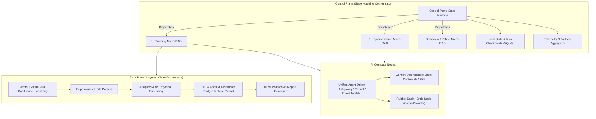
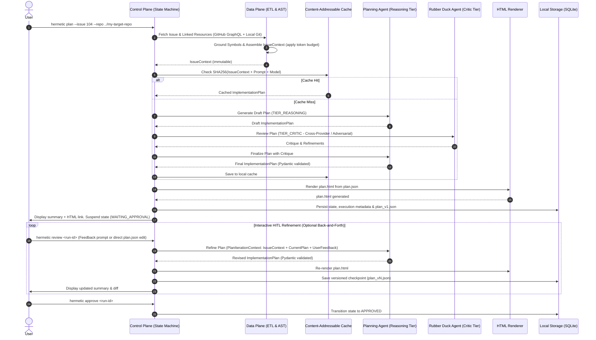
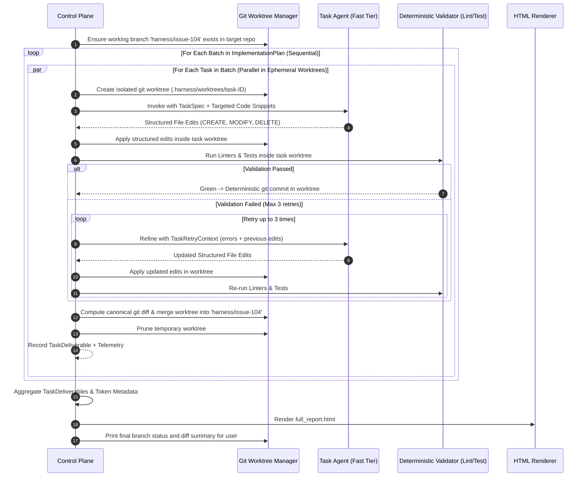

# Project Outline (Revised): Hermetic Pure-Function DAG AI Coding Harness

## 1. Executive Summary & Core Philosophy

The **Hermetic Pure-Function DAG AI Coding Harness** is a code generation and software engineering harness built on a foundational separation of concerns:
* **Deterministic tasks** (data fetching, parsing, repo indexing, AST analysis, schema validation, linting, testing, and git operations) are executed hermetically, idempotently, and predictably by traditional software engineering components.
* **Probabilistic AI models (LLMs)** are invoked exclusively for tasks requiring judgement, synthesis, planning, code generation, and critical review.

LLMs are treated as **pure-ish, bounded functions** inside execution nodes:
* **Strict Input**: An immutable, self-contained, typed schema (e.g., `IssueContext`) containing all necessary code snippets, issue details, and documentation. No ad-hoc tool wandering or retrieval inside the node.
* **Bounded Compute**: Prompt template, system instructions, temperature `0.0`, and assigned model tier.
* **Strict Output**: A strictly validated deliverable schema (e.g., `ImplementationPlan`, `TaskDeliverable`).

---

## 2. System Architecture & Extensibility

The system is organized into two primary planes and an orchestration model:



### A. Control Plane (State Machine over Micro-DAGs)
* **Architecture Pattern**: State Machine orchestrating focused, acyclic Micro-DAGs (`Intake` $\to$ `Planning` $\to$ `Critic / Rubber Duck` $\to$ `Interactive HITL Review` $\to$ `Batch Execution` $\to$ `Verification` $\to$ `Final Delivery`).
* **State & Checkpoints**: Powered by local SQLite (`.harness/state.db`). Supports full suspension and resumption (e.g., waiting for human review or recovering from a transient failure).
* **Interactive HITL Refinement**: The user can converse, critique, or directly edit the plan. Every feedback turn triggers a functional state transition yielding a versioned checkpoint (`plan_v1.json`, `plan_v2.json`) with instant rollback capabilities.
* **Telemetry & Metrics**: Every node execution returns a `NodeExecutionMetadata` record (latency, tokens, cost, cache status). The Control Plane natively aggregates these into run summaries without requiring external hooks.
* **Hermetic Isolation**: All code generation occurs on dedicated Git branches (e.g., `harness/issue-<id>`). Parallel tasks within a batch are sandboxed in ephemeral `git worktree` instances. AI nodes have read-only access and emit structured edits; only the deterministic harness can commit and merge.

### B. Data Plane (Deterministic & Extensible Layers)
Structured using clean architecture layers:
1. `client`: Native HTTP/GraphQL clients for issue trackers and doc systems (GitHub GraphQL/REST, Jira, Confluence).
2. `repository`: Local filesystem and local Git repository access for target repos, including ephemeral worktree management (`worktree.py`).
3. `adapter`: Normalizers that transform external payloads (GitHub issues, Jira tickets, PRs, Confluence pages, markdown docs) into unified internal representations.
4. `indexer`: Deterministic codebase grounding (symbol resolution via regex/AST/ripgrep).
5. `etl`: Aggregates, deduplicates, and validates data into self-contained context schemas with strict token budget enforcement.
6. `renderer`: Automatically renders human-readable HTML previews (`plan.html`, `review.html`) from JSON schemas using lightweight Jinja2 templates whenever schemas are generated or updated.

### C. Pure Compute Plane & Unified Agent Driver
* **Stateless Compute Behind Interactive UX**: Regardless of whether the backend is Direct Model APIs (Gemini, Claude, GPT), Antigravity, or Copilot, all AI node executions are **stateless, non-interactive invocations with evolving supporting context**.
* **Driver Modalities**:
  1. `DirectDriver` (LiteLLM / Native SDKs): Direct HTTP API requests with schema-constrained JSON mode.
  2. `AntigravityDriver` (Headless CLI / Subprocess): Runs Antigravity headlessly with an immutable task schema and extracts structured JSON outputs.
  3. `CopilotDriver` (CLI / API): Headless Copilot invocation with bounded input prompts.
* **Why This Matters**: The user gets the rich, fluid experience of an interactive session, while the compute engine preserves 100% pure-function determinism, token accounting, and content-addressable caching.

### D. Future-Extensibility ("Not Future-Excluded")
* **Jira & Confluence Integration**: The core planning engine depends only on `IssueContext` and `ExternalDoc`. Adding Jira/Confluence only requires a `JiraClient` and `ConfluenceAdapter` in the Data Plane. The planning and execution compute nodes never know or care which provider supplied the ticket.
* **Multi-Repo Updates**: The schema supports an optional `repo_name` / `repo_path` override per `TaskItem`. If a feature touches both a frontend and backend repository, different batches/tasks can target different repos while sharing the same unified plan and execution report.
* **Self-Updating (Dogfooding)**: Because the harness targets repositories via local path (`--repo .`), the harness can run on itself (`hermetic plan --issue 42 --repo .`). It creates branch `harness/issue-42`, generates a plan for its own codebase, modifies its own code in `src/hermetic/`, verifies changes against its own test suite (`pytest`), and produces an approval report.

---

## 3. Workflows & Standard Operating Procedures

### Workflow 1: Implementation Planning, Critic, & Interactive HITL



1. **Intake & Fetching**:
   - Issue and discussion retrieved via GitHub GraphQL in a single HTTP request (or Jira API).
   - High-confidence code references resolved locally against the target repo.
2. **Context Assembly**:
   - Data packed into immutable `IssueContext` with token budget caps.
3. **Planning & Rubber Ducking**:
   - `TIER_REASONING` generates initial plan with tasks partitioned into file-disjoint batches.
   - `TIER_CRITIC` reviews for edge cases, missing verification steps, race conditions, and oversized tasks.
   - Final `ImplementationPlan` produced and sanitized/validated via Pydantic.
4. **Auto-Rendering**:
   - `plan.html` is automatically compiled from `plan.json` for rich visual review.
5. **Interactive HITL Refinement (Pure State Transitions, Not Chat Logs)**:
   - The user inspects `plan.html` or the CLI summary.
   - The user can converse/critique via interactive CLI (`hermetic review <run-id>` or `hermetic plan --resume <run-id> --feedback "..."`), or edit `plan.json` directly.
   - **No Conversational Transcript Accumulation**: The harness does **not** compile growing multi-turn chat logs into the prompt. Instead, each turn is a pure state transformation:
     $$\text{Plan}_{n+1} = \text{PlanningNode}(\text{IssueContext}, \text{Plan}_n, \text{UserFeedback}_n)$$
     The LLM sees only the immutable `IssueContext`, the current structured `plan.json`, and the user's latest feedback directive.
   - **Semantic Diff for the Human**: The CLI presents the human with a concise semantic diff of what was changed (added/modified/removed tasks or batches) between versions, and deterministically regenerates `plan.html`.
   - Each refinement turn saves a versioned checkpoint (`plan_v1.json`, `plan_v2.json`, etc.) with instant rollback support.
6. **Review Gate**:
   - Suspends in SQLite until user approves via `hermetic approve <run-id>`, which re-validates the schema before unblocking execution.

---

### Workflow 2: Batch Execution & Ephemeral Worktree Verification



1. **Batch Sequencing & File Disjointness**:
   - Batches execute sequentially. Tasks within a batch are planned to touch disjoint file sets and execute concurrently.
2. **Ephemeral Git Worktree Sandboxing**:
   - For each concurrent task, the harness creates an isolated git worktree (`.harness/worktrees/task-<id>`). Tests and file modifications run strictly in isolation without workspace collisions.
3. **Structured File Edits (Deterministic)**:
   - LLMs emit structured file edits (`StructuredFileEdit`: path, action, content/search-and-replace blocks). The LLM has zero shell or git access.
4. **Deterministic Validation & Git Operations**:
   - The harness applies edits, runs linters (e.g. `ruff format`), and executes verification commands inside the worktree.
   - On green, the harness commits, computes the canonical `git diff`, merges the task branch into `harness/issue-<id>`, and removes the worktree.
5. **Pure-Function Self-Healing Loop**:
   - When validation fails, a `TaskRetryContext` (attempt number, compiler/test output, failed edits) is passed as an immutable input to the model.
   - Every retry records a distinct `NodeExecutionMetadata` entry in SQLite for full retry tracking and cost auditability.
6. **Aggregation**: `FullImplementationReport` and `full_report.html` generated with diffs, test summaries, and token counts.

---

## 4. Contract Schemas (Pydantic Models)

All schemas are strictly typed, serializable to JSON, and explicitly reference the target repository.

### A. `IssueContext` (Preloaded & Self-Contained)
```python
class CodeSnippet(BaseModel):
    file_path: str
    start_line: int
    end_line: int
    content: str
    symbol_name: str | None = None
    repo_name: str | None = None  # Populated if multi-repo

class ExternalDoc(BaseModel):
    url_or_id: str
    title: str
    content: str
    source_type: str  # "github_wiki", "confluence", "pr", "issue", "markdown"

class IssueContext(BaseModel):
    schema_version: str = "1.0"
    repo_name: str          # e.g., "owner/my-app"
    repo_path: str          # Local filesystem path to target repo
    base_branch: str        # e.g., "main"
    issue_id: str           # GitHub issue number or Jira key (e.g. "PROJ-123")
    title: str
    body: str
    author: str
    labels: list[str]
    comments: list[str]
    code_snippets: list[CodeSnippet]
    referenced_docs: list[ExternalDoc]
    user_clarifications: dict[str, str] = Field(default_factory=dict)
```

### B. `ImplementationPlan` & Interactive Refinement
```python
class TaskItem(BaseModel):
    task_id: str
    title: str
    instructions: str
    target_files: list[str]  # Must be strictly disjoint across tasks in the same batch
    expected_outcome: str
    verification_command: str | None = None
    repo_name: str | None = None  # None = default to plan.repo_name

class TaskBatch(BaseModel):
    batch_index: int
    name: str
    tasks: list[TaskItem]  # Executed in parallel across ephemeral git worktrees

class ImplementationPlan(BaseModel):
    schema_version: str = "1.0"
    repo_name: str
    repo_path: str
    base_branch: str
    working_branch: str    # e.g., "harness/issue-104"
    issue_id: str
    summary: str
    architectural_notes: str
    acceptance_criteria: list[str]
    testing_strategy: str
    batches: list[TaskBatch]  # Executed sequentially

class UserFeedback(BaseModel):
    iteration: int
    timestamp: str
    feedback_text: str

class PlanIterationContext(BaseModel):
    issue_context: IssueContext
    current_plan: ImplementationPlan
    critic_critique: str | None = None
    feedback_history: list[UserFeedback] = Field(default_factory=list)
```

### C. `TaskDeliverable`, `StructuredFileEdit`, & `TaskRetryContext`
```python
class SearchReplaceBlock(BaseModel):
    search_target: str
    replacement: str

class StructuredFileEdit(BaseModel):
    file_path: str
    action: Literal["CREATE", "MODIFY", "DELETE"]
    new_content: str | None = None       # Full content for newly created files
    blocks: list[SearchReplaceBlock] = Field(default_factory=list) # Chunks for modifications

class TaskRetryContext(BaseModel):
    task_spec: TaskItem
    attempt_number: int                  # 1..3
    failed_edits: list[StructuredFileEdit]
    validation_error_output: str         # Captured linter / test stdout and stderr
    previous_patch_diff: str | None = None

class TaskDeliverable(BaseModel):
    task_id: str
    status: Literal["SUCCESS", "FAILED", "SKIPPED"]
    repo_name: str | None = None
    structured_edits: list[StructuredFileEdit] = Field(default_factory=list)
    patch_diff: str = ""                 # Canonical diff generated deterministically by Git
    test_output: str | None = None
    retry_count: int = 0
    error_message: str | None = None
    input_tokens: int = 0
    output_tokens: int = 0
    latency_ms: int = 0

class FullImplementationReport(BaseModel):
    run_id: str
    repo_name: str
    repo_path: str
    issue_id: str
    branch_name: str
    overall_status: Literal["PASSED", "FAILED_VERIFICATION", "INCOMPLETE"]
    task_deliverables: list[TaskDeliverable]
    total_latency_ms: int
    token_usage_summary: dict[str, int]  # {"total_input": X, "total_output": Y, "estimated_cost_usd": Z}
```

### D. `ResearchDossier` (Spikes & Investigations)
```python
class ResearchDossier(BaseModel):
    topic: str
    repo_name: str
    objective: str
    findings: list[str]
    tradeoffs_analyzed: list[dict[str, str]]
    recommended_path: str
    open_questions: list[str]
    citations: list[str]
```

### E. `ReviewReport` (Code Review)
```python
class ReviewFinding(BaseModel):
    severity: Literal["CRITICAL", "WARNING", "SUGGESTION"]
    file_path: str
    line_number: int | None
    comment: str
    suggested_fix: str | None

class ReviewReport(BaseModel):
    pr_id: str
    repo_name: str
    summary: str
    passed: bool
    findings: list[ReviewFinding]
    test_coverage_assessment: str
```

---

## 5. Technical Decisions & Infrastructure

### A. Python Version & Environment: Python 3.12 pinned via `uv`
* **Target Version: Python 3.12**
  * *Why 3.12*: Python 3.12 is the current industry sweet spot. It provides maximum performance, full Pydantic v2 support, and 100% precompiled binary wheel availability on Windows.
  * *Addressing Python 3.14 on the host machine*: You do **not** need to uninstall or downgrade Python on your host system. `uv` isolates Python runtimes automatically.
  * Running `uv python pin 3.12` instructs `uv` to download and isolate a dedicated Python 3.12 runtime, completely bypassing host PATH versions.
* **100% `uv` Project Management**:
  * Dependencies declared in `pyproject.toml` and locked in `uv.lock`.
  * Commands run seamlessly: `uv run hermetic ...`.
  * Eliminates global package contamination and manual virtualenv activation.

### B. Telemetry & Token Tracking: Native Result Metadata
* No complex third-party hooks required.
* The `AgentDriver` extracts native token counts (`usage_metadata`) and latency from LLM responses.
* Each node yields a `NodeExecutionMetadata` object:
  ```python
  class NodeExecutionMetadata(BaseModel):
      node_id: str
      model_name: str
      latency_ms: int
      input_tokens: int
      output_tokens: int
      cached: bool
  ```
* The Control Plane sums these across all nodes into `FullImplementationReport.token_usage_summary`.

### C. Rubber Duck / Critic Architecture (`TIER_CRITIC`)
To prevent models from rubber-stamping their own mistakes:
* **Multi-Provider Critique (Preferred)**: When configured, the planning node uses Model A (e.g. Gemini Pro / Claude Sonnet), while the critic node uses Model B from a different provider family. Different architectures catch blind spots that self-critique misses.
* **Adversarial Persona Fallback**: If using a single provider, the critic node uses a strictly scoped adversarial prompt ("*Act as a skeptical Principal Engineer. Find race conditions, unhandled edge cases, missing rollback strategies, and oversized tasks.*").

### D. Ephemeral Git Worktree Isolation & Deterministic Merges
To eliminate concurrency hazards during parallel task execution:
* **No Direct Working Tree Mutation**: Parallel tasks never touch the primary working branch directly.
* **Ephemeral Worktrees**: For each task $T_i$ in a batch, the Data Plane Git Manager creates a temporary worktree:
  ```bash
  git worktree add -b harness/task-Ti .harness/worktrees/task-Ti <batch_base_commit>
  ```
* **Read-Only Model Boundary**: The LLM runs with read-only view of the code. It produces structured file edits (`StructuredFileEdit`).
* **Deterministic Execution & Commits**:
  1. The deterministic harness writes file modifications inside `.harness/worktrees/task-Ti`.
  2. Formatters (e.g. `ruff format`) and local verification commands run strictly inside that worktree.
  3. If verification passes, the harness creates a standard commit on `harness/task-Ti`.
  4. The harness deterministically merges `harness/task-Ti` into the batch branch (`harness/issue-<id>`).
  5. The temporary worktree is pruned (`git worktree remove --force`).
* **Conflict Prevention**: Batches enforce file-disjointness at plan time. If an unexpected merge collision occurs, it is detected deterministically by Git rather than hallucinated by an agent.

### E. Structured File Edits vs. Raw Git Diffs: The Deterministic Boundary
A critical architectural boundary must be maintained between probabilistic model synthesis and deterministic software engineering:
* **The Probabilistic Boundary (Model Synthesis)**:
  - The creative decision of *what* code to add, modify, or delete is inherently probabilistic; a deterministic script cannot predict code changes before an LLM synthesizes them.
  - The LLM expresses this intent strictly through the `StructuredFileEdit` schema:
    - `action="CREATE"` or `"OVERWRITE"` with `new_content`.
    - `action="MODIFY"` with targeted `SearchReplaceBlock(search_target=..., replacement=...)`.
  - Asking LLMs to emit raw unified diff syntax (`diff --git a/... b/...`) fails frequently because LLMs are poor at line-offset arithmetic and hunk headers.
* **The Deterministic Boundary (Harness Execution)**:
  - Once the model returns `StructuredFileEdit`, the LLM has zero further control over the filesystem or version control.
  - The Data Plane executes 100% deterministic code:
    1. **Target Verification**: Validates that `search_target` exists uniquely in the file (fail-fast if missing or ambiguous).
    2. **String/AST Substitution**: Applies the exact replacement cleanly in the ephemeral worktree.
    3. **Deterministic Formatting**: Runs code formatters (e.g., `ruff format`, `black`, `prettier`) so formatting is uniform and predictable.
    4. **Canonical Diff Generation**: Runs `git diff` via subprocess on the actual filesystem. Git itself calculates the canonical, syntactically pristine unified diff stored in `TaskDeliverable.patch_diff`.
    5. **Deterministic Verification**: Executes linters and tests inside the worktree.
    6. **Deterministic Commits & Merges**: Creates git commits and merges branches without any LLM intervention.

### F. Output Defense: Strict Structured Outputs & Deterministic JSON Sanitizer
Even with API-level JSON mode (`response_format={"type": "json_object"}` or schema-constrained decoding), models occasionally include markdown wrappers, trailing commas, or control characters.
A two-tier defense guarantees deterministic parsing:
1. **Deterministic Sanitizer (`sanitizer.py`)**:
   - Strips markdown code fences (````json ... ````).
   - Trims conversational preambles/postscripts.
   - Normalizes trailing commas (`[1, 2,]` $\to$ `[1, 2]`) using fast regex passes before `json.loads`.
2. **Pydantic Validation**:
   - Parses into validated Pydantic model (`Model.model_validate_json(clean_str)`).
   - If validation fails, the Pydantic error details are structured into a zero-shot repair prompt or default fallback.

### G. Interactive HITL & Versioned Plan Refinement: Functional Transitions, Not Chat Transcripts
* **Why We Avoid Conversational Message Lists**:
  In standard chatbot agents, prompts accumulate a multi-turn chat transcript (`[User, Assistant, User, Assistant, ...]`). Over several turns, obsolete ideas, hallucinated tangents, and conversational fluff inflate token costs and degrade reasoning quality.
* **Functional Transition Model**:
  Every interactive turn is treated as a pure state transition:
  $$\text{Plan}_{n+1} = \text{PlanningNode}(\text{IssueContext}, \text{Plan}_n, \text{UserFeedback}_n)$$
  - **What the LLM sees as context**:
    1. `IssueContext` (the immutable problem definition and repository symbols).
    2. `current_plan` (the last validated `ImplementationPlan` JSON—the current state of the architecture).
    3. `UserFeedback` (the user's latest critique or directive).
  - **What the Human sees**:
    - A clear, concise **semantic diff** computed between $\text{Plan}_n$ and $\text{Plan}_{n+1}$ (e.g., `+ Added Task 2.3`, `~ Modified Batch 1 scope`, `- Removed Task 3.1`).
    - The automatically refreshed `plan.html` preview in the browser.
* **CLI Interactivity**:
  - Interactive REPL: `hermetic review <run-id>` allows natural conversation, critique, and guidance in the terminal.
  - Scriptable / Single-command feedback: `hermetic plan --resume <run-id> --feedback "Split Task 2 into two steps and use SQLite WAL mode"`.
  - Direct Edit: The user can open `.harness/runs/plan/<run-id>/plan.json` in their editor, make manual edits, and resume. The harness validates the JSON against Pydantic and refreshes `plan.html` with zero LLM tokens spent.
* **Reproducibility & Rollback**:
  - Each feedback round generates a versioned artifact (`plan_v1.json`, `plan_v2.json`, `plan.html`).
  - Checkpoints are persisted in SQLite, allowing instant rollback (`--revert-to 1`) if an agent wanders off course.
* **Driver Agility (Copilot, Antigravity, Direct APIs)**:
  Because each turn is a stateless transition rather than an ongoing chat session, any provider can power the refinement turn:
  - **Antigravity**: Headless single-turn task execution with bounded context.
  - **Copilot**: Headless CLI / Language Server call.
  - **Direct APIs**: Stateless LiteLLM / Gemini / Claude API calls with schema enforcement.
  The harness owns the state, versioning, and rollback logic, keeping the AI driver strictly pure and stateless.

### H. Minimal DAG Engine (`graphlib.TopologicalSorter` + `asyncio.TaskGroup`)
* **Zero Framework Bloat**: No heavy external dependencies (no Airflow, Celery, or LangGraph).
* **Implementation Strategy**:
  - Uses Python's built-in `graphlib.TopologicalSorter` for dependency resolution.
  - Uses `asyncio.TaskGroup` for concurrent execution of independent tasks.
  - Total implementation: under 150 lines of clean, strictly typed Python in `src/hermetic/control/dag_engine.py`.
  - State transitions and checkpoint records are logged to SQLite before and after each node execution.

### I. Persistence & Artifact Organization
Runs are organized hierarchically by **workflow** and **identifier/timestamp**:

```
.harness/
├── state.db                                     # SQLite state & checkpoints
├── cache/                                       # Content-addressable SHA256 cache
│   └── 8f4b2c...json
├── worktrees/                                   # Ephemeral git worktrees (pruned after run)
│   ├── task-1/
│   └── task-2/
└── runs/
    ├── plan/
    │   └── issue-104_20260912-104522/
    │       ├── issue_context.json
    │       ├── plan_v1.json
    │       ├── plan_v2.json                     # Interactive refinement versions
    │       ├── plan.json                        # Active approved plan
    │       ├── plan.html                        # Auto-rendered preview
    │       └── metadata.json
    ├── implement/
    │   └── issue-104_20260912-110500/
    │       ├── full_report.json
    │       ├── full_report.html                 # Auto-rendered preview
    │       └── patches/
    │           ├── task-1.patch
    │           └── task-2.patch
    └── research/
        └── spike-auth_20260912-120000/
            ├── dossier.json
            └── dossier.html
```

### J. Auto-Rendering HTML Previews
* A dedicated renderer module in `src/hermetic/data/renderer/` uses lightweight Jinja2 templates.
* Whenever `plan.json` or `full_report.json` is generated or updated, `render_plan_to_html()` is called deterministically to output `plan.html`.
* Provides an interactive, clean interface with collapsible task batches, file links, and verification status for human review.

---

## 6. Project Directory Layout

```
hermetic-pure-function-dag-coding-harness/
├── pyproject.toml              # Dependencies & metadata (uv managed)
├── uv.lock                     # Deterministic dependency lockfile
├── .python-version             # Pinned to 3.12 (via uv)
├── README.md                   # Quickstart and overview
├── ProjectOutline.md           # This specification document
├── .harness/                   # Local runtime data (gitignored)
│   ├── state.db                # SQLite run state & checkpoints
│   ├── cache/                  # Content-addressable cache entries
│   ├── worktrees/              # Ephemeral git worktrees
│   └── runs/                   # Structured run artifacts by workflow
├── src/
│   └── hermetic/
│       ├── __init__.py
│       ├── cli/                # Command-line interface (Typer/Rich)
│       │   ├── __init__.py
│       │   ├── main.py
│       │   └── review.py       # Interactive HITL plan review REPL
│       ├── control/            # Control Plane
│       │   ├── __init__.py
│       │   ├── state_machine.py # Workflow state machine & HITL suspension
│       │   ├── dag_engine.py   # Minimal graphlib.TopologicalSorter async runner
│       │   └── telemetry.py    # Native execution metadata aggregator
│       ├── data/               # Data Plane
│       │   ├── __init__.py
│       │   ├── client/         # GitHub, Jira, Confluence clients
│       │   ├── repository/     # Local git, target repo access & worktree manager
│       │   │   ├── __init__.py
│       │   │   ├── git_manager.py
│       │   │   └── worktree.py # Ephemeral git worktree sandboxing
│       │   ├── adapter/        # External payload normalizers
│       │   ├── indexer/        # AST / symbol grounding
│       │   ├── etl/            # Context assembler & budget allocator
│       │   └── renderer/       # Jinja2 HTML/Markdown report generator
│       ├── compute/            # AI Compute & Adapters
│       │   ├── __init__.py
│       │   ├── agent_driver.py # Unified Copilot / Antigravity / API driver
│       │   ├── sanitizer.py    # Resilient JSON cleaning & validation defense
│       │   ├── critic.py       # Rubber Duck / Critic evaluation node
│       │   ├── cache.py        # Content-addressable SHA256 cache
│       │   └── prompts/        # Hermetic prompt templates
│       └── schemas/            # Pydantic Contract Schemas
│           ├── __init__.py
│           ├── context.py      # IssueContext, CodeSnippet, ExternalDoc
│           ├── plan.py         # ImplementationPlan, TaskBatch, TaskItem, PlanIterationContext
│           ├── deliverable.py  # TaskDeliverable, StructuredFileEdit, TaskRetryContext
│           └── research.py     # ResearchDossier, ReviewReport
└── tests/                      # Unit and integration tests
    ├── test_dag_engine.py
    ├── test_schemas.py
    ├── test_sanitizer.py
    ├── test_worktree.py
    ├── test_cache.py
    └── test_etl.py
```

---

## 7. Immediate Next Steps (Phase 1 Implementation)

1. **Initialize Project**: Pin Python 3.12 (`uv python pin 3.12`), declare dependencies (`pydantic>=2.0`, `typer`, `rich`, `jinja2`, `aiosqlite`, `pytest`).
2. **Implement Core Schemas**: Write `context.py`, `plan.py`, `deliverable.py`, and `research.py` in `src/hermetic/schemas/` with interactive feedback and retry models.
3. **Implement JSON Sanitizer & Test Suite**: Build `sanitizer.py` and `tests/test_sanitizer.py` verifying resilient handling of markdown fences, trailing commas, and Pydantic validation.
4. **Implement HTML Renderer**: Create the Jinja2 template and compiler to generate `plan.html` from `plan.json`.
5. **Implement Minimal DAG Engine & Local Cache**: Write the lightweight `graphlib`-based runner and SHA256 cache.
6. **Implement End-to-End Walking Skeleton (Workflow 1)**: Issue intake $\to$ `IssueContext` $\to$ Planning Node $\to$ Critic Node $\to$ Interactive Review $\to$ `plan.json` $\to$ `plan.html`.
