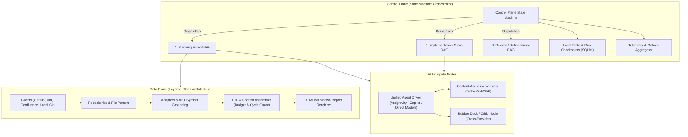
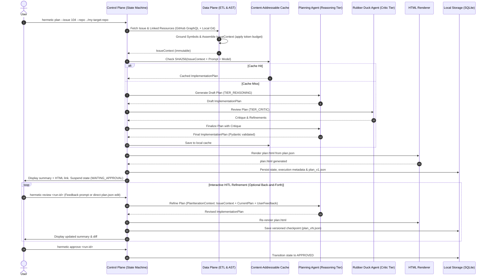
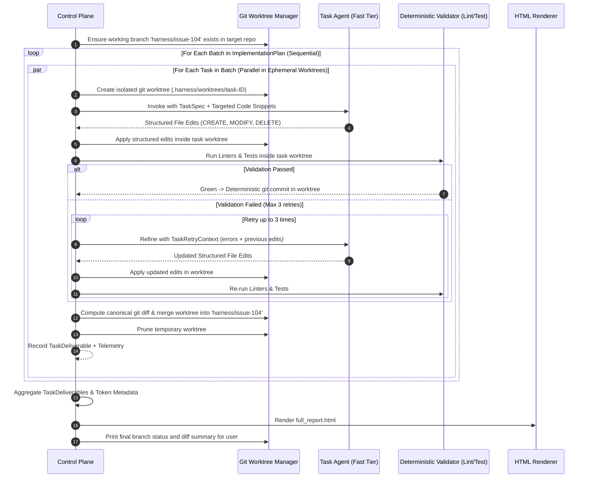

# System Architecture & Extensibility

The system is organized into two primary planes and an orchestration model:

## A. Control Plane (State Machine over Micro-DAGs)
* **Architecture Pattern**: State Machine orchestrating focused, acyclic Micro-DAGs (`Intake` -> `Planning` -> `Critic / Rubber Duck` -> `Interactive HITL Review` -> `Batch Execution` -> `Verification` -> `Final Delivery`).
* **State & Checkpoints**: Powered by local SQLite (`.harness/state.db`). Supports full suspension and resumption (e.g., waiting for human review or recovering from a transient failure).
* **Interactive HITL Refinement**: The user can converse, critique, or directly edit the plan. Every feedback turn triggers a functional state transition yielding a versioned checkpoint.
* **Telemetry & Metrics**: Every node execution returns a `NodeExecutionMetadata` record. The Control Plane natively aggregates these into run summaries.
* **Hermetic Isolation**: All code generation occurs on dedicated Git branches in sandboxed ephemeral `git worktree` instances.

## B. Data Plane (Deterministic & Extensible Layers)
Structured using clean architecture layers:
1. `client`: Native HTTP/GraphQL clients for issue trackers and doc systems.
2. `repository`: Local filesystem and local Git repository access, including ephemeral worktrees.
3. `adapter`: Normalizers that transform external payloads into unified internal representations.
4. `indexer`: Deterministic codebase grounding (symbol resolution via regex/AST/ripgrep).
5. `etl`: Aggregates and validates data into self-contained context schemas with strict token budget enforcement.
6. `renderer`: Automatically renders human-readable HTML previews from JSON schemas.

## C. Pure Compute Plane & Unified Agent Driver
Regardless of the backend (Direct Model APIs, Antigravity, or Copilot), all AI node executions are **stateless, non-interactive invocations with evolving supporting context**.

---

# Workflows & Standard Operating Procedures

## Workflow 1: Implementation Planning, Critic, & Interactive HITL

## Workflow 2: Batch Execution & Ephemeral Worktree Verification

